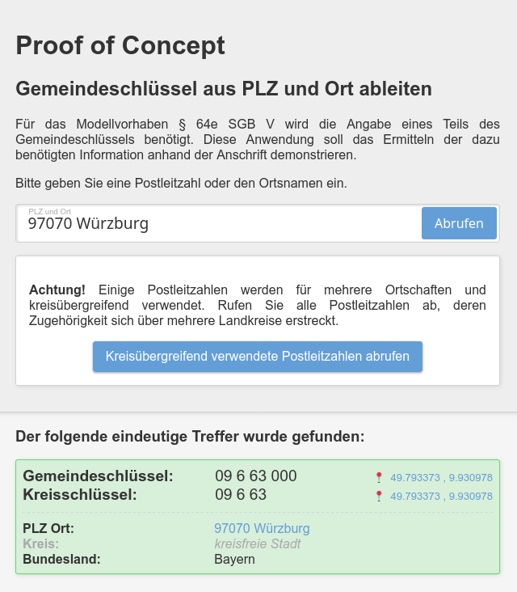

# Proof of Concept - Kreisschlüssel aus PLZ und Ort ableiten

Für das Modellvorhaben §64e wird die Angabe eines Teils des Gemeindeschlüssels benötigt.
Der entsprechende Teil kennzeichnet den Landkreis oder die kreisfreie Stadt.

Diese Anwendung soll das Ermitteln der dazu benötigten Information anhand der Anschrift demonstrieren.

Zudem wird ermittelt, welche Postleitzahlen in mehreren Landkreisen verwendet werden und daher die Postleitzahl alleine
nicht zur Ermittlung des Kreisschlüssels genügt.

## Geokoordinaten, -informationen und weitere verwendete Software

Die Angaben zu den Koordinaten eines Kreises wurden
mittels [OpenStreetMap](https://nominatim.openstreetmap.org/ui/search.html) ermittelt.

Die Angaben zur Einwohnerzahl stammen aus
der [Zensus Datenbank](https://ergebnisse.zensus2022.de/datenbank/online/statistic/1000A/table/1000A-0000) mit
Stand 2022.

Verwendetes Kartenmaterial nutzt bearbeitete Informationen des Regionalatlas Deutschland, veröffentlicht unter der
[Datenlizenz Deutschland – Namensnennung – Version 2.0](https://www.govdata.de/dl-de/by-2-0).

Zur Darstellung von Diagrammen wird [Apache ECharts](https://echarts.apache.org/en/index.html) verwendet.